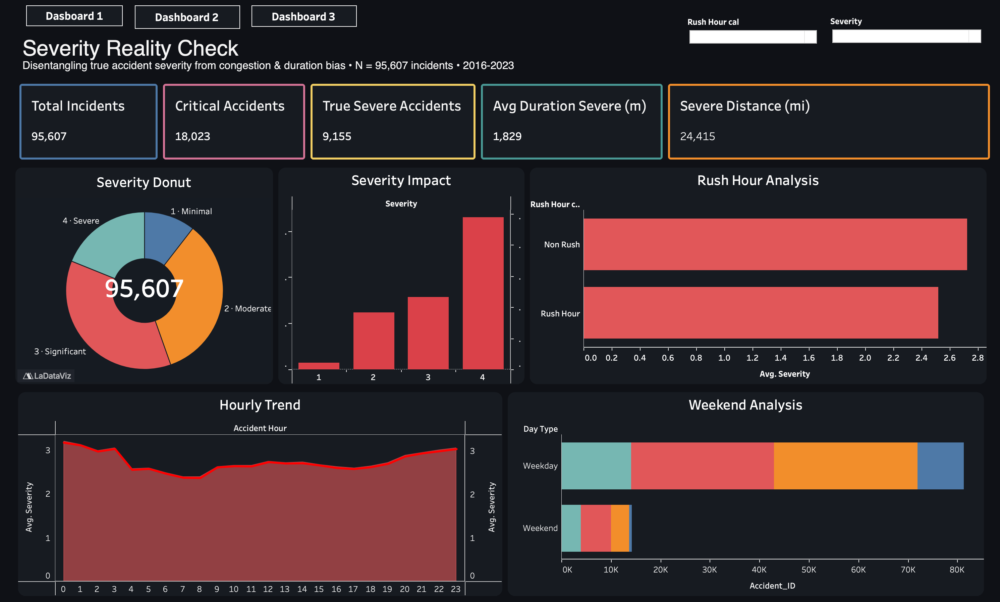
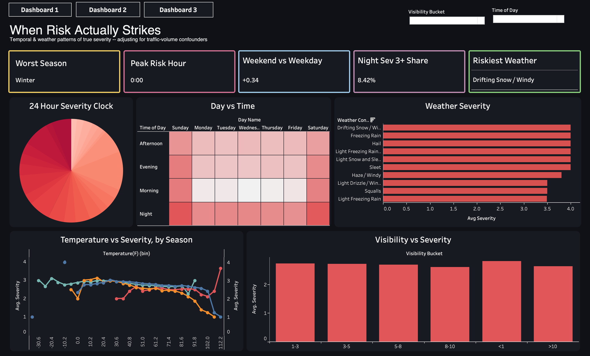
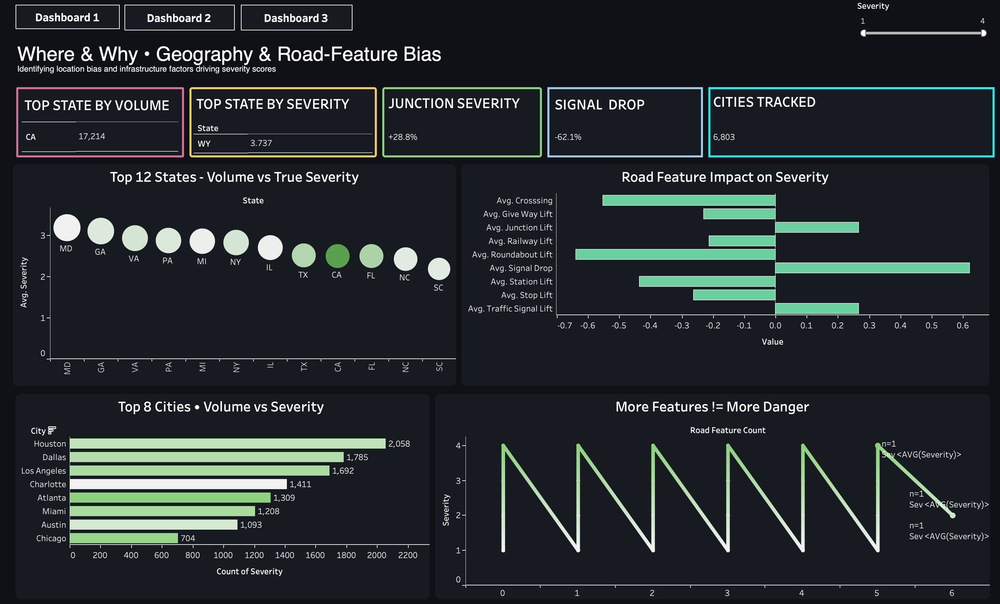

---

title: "DeliverIQ — Severity Reality Check"
subtitle: "Disentangling True Accident Severity from Congestion, Time-of-Day, and Location Bias"
author: "Newton School of Technology · DVA Capstone 2 · Section-A Team G12"
date: "April 2026"
geometry: "left=2cm,right=2cm,top=2cm,bottom=2cm"
fontsize: 11pt

## linestretch: 1.15

colorlinks: true
linkcolor: "NavyBlue"
urlcolor: "NavyBlue"
toc: true
toc-depth: 2
numbersections: true

# 1. Cover Page

| Field                 | Detail                                                                  |
| --------------------- | ----------------------------------------------------------------------- |
| **Project Codename**  | DeliverIQ                                                               |
| **Project Title**     | Severity Reality Check                                                  |
| **Subtitle**          | Disentangling True Accident Severity from Congestion Bias               |
| **Sector**            | Transportation & Public Safety                                          |
| **Section**           | A                                                                       |
| **Team ID**           | G12                                                                     |
| **Faculty Mentor**    | *Fill mentor name*                                                      |
| **Institute**         | Newton School of Technology                                             |
| **GitHub Repository** | <https://github.com/shiavm006/Section-A_G12_DeliverIQ>                  |
| **Tableau Dashboard** | <https://public.tableau.com/views/RoadAccidentDataofUSA_17773613139680/Dashboard1> |
| **Submission Date**   | April 29, 2026                                                          |

**Team Members**

- Shivam Mittal — Project Lead    (shivam.mittal2024@nst.rishihood.edu.in)
- Satyam Kumar — Data Lead    (satyam.kumar2024@nst.rishihood.edu.in)
- Keshav — ETL Lead    (keshav.2024@nst.rishihood.edu.in)
- Mohit Singh — Analysis Lead    (mohit.singh2024@nst.rishihood.edu.in)
- Prachee Dhar — Visualization Lead    (prachee.dhar2024@nst.rishihood.edu.in)
- Rishita Boisnobi — Strategy + PPT & Quality Lead    (rishita.boisnobi2024@nst.rishihood.edu.in)

# 2. Executive Summary

Public road-accident datasets are widely used by insurers, logistics planners, and state Departments of Transportation (DOTs) to assess corridor risk, set premiums, and allocate infrastructure dollars. The most-used severity field in the largest US accidents dataset, however, measures *traffic-flow impact* (short delay vs. long delay) -- **not** physical crash severity. A fender-bender at rush hour can register as Severity 4, while a fatal head-on collision on a quiet rural road may register as Severity 1. Decisions taken on the raw signal therefore systematically over-weight congested urban corridors and under-invest in genuinely high-risk locations.

**The project applies an operational definition of "True Severe"** -- a Severity-4 accident whose road impact extends at least half a mile -- and quantifies how much of the conventional severity signal is actually congestion noise.

**Key findings**

- Roughly **half of all accidents flagged as Severity 4 fail the True-Severe threshold.** Public severity counts are inflated by congestion artifacts.
- **Average severity peaks at midnight (12 AM)**, not during evening rush hour. Volume peaks at 5 PM; *risk* peaks 6-7 hours later.
- **Pennsylvania, not California, leads** the True-Severe leaderboard. PA's per-accident severity is roughly 3 x the national average despite ~3 % of total accident volume.
- **Most severe accidents occur in clear weather** (avg visibility ~ 9.1 mi). Conventional wisdom that fog / storm conditions drive severity is largely wrong in this dataset.
- **Traffic signals reduce per-accident severity by ~0.4 points** -- a quantifiable, ROI-positive infrastructure intervention.

**Recommended actions**

1. Insurers should down-weight publicly reported Severity 4 by ~50 % when used as a pricing input.
2. State DOTs should prioritize signal installations at top-N junction hotspots (Signal Drop ~ 0.4 severity points = measurable ROI).
3. Logistics fleets should re-rank corridors using a True-Severe Index, not raw counts.
4. Federal grant programs should reweight per-state allocations using True Severe rather than total volume.
5. Infrastructure planners should rebalance away from visibility-only interventions (where the effect is small) toward junction redesigns and signal coverage.

\newpage

# 3. Sector & Business Context

The US road network supports more than **3 trillion vehicle-miles per year**, and the FHWA estimates traffic crashes cost the US economy more than **$1 trillion annually** when medical care, lost productivity, congestion, and property damage are included. The auto-insurance industry alone underwrites more than **$300 billion in annual premiums**, much of it priced using publicly available crash and incident data as one input.

Three stakeholder groups make daily decisions on this data:

- **Property-and-Casualty (P&C) insurers** ingest public severity feeds into pricing models. The accuracy of those feeds directly affects premium fairness, loss ratios, and adverse-selection risk.
- **State Departments of Transportation (DOTs)** allocate billions in capital each year to signals, signage, lighting, and lane redesigns. Severity-weighted hotspot maps are a primary input.
- **National logistics fleets and last-mile carriers** route around high-risk corridors and adjust dispatch windows. Mis-priced corridor risk leads to either over-cautious routing (lost time) or under-cautious routing (claim spikes).

**Why this problem matters now.** Two trends amplify the cost of acting on biased severity data: (1) accident-reporting APIs increasingly feed real-time pricing engines, so any systematic bias compounds quickly; and (2) the post-COVID rebound in vehicle-miles-traveled has pushed accident volume back to pre-pandemic levels, meaning more decisions, more premiums, and more capital flow through the same biased input.

The decision-maker this report serves is the **risk and pricing team at a national P&C insurer**, with secondary applicability to state DOT planners and national fleet operators. The corrected severity signal proposed here is portable across all three.

# 4. Problem Statement & Objectives

## 4.1 Formal Problem Definition

> **Public severity classifications in US accident data conflate traffic-flow impact with physical crash severity. Decisions made directly on the raw severity field -- including premium pricing, infrastructure investment, and corridor risk ranking -- are systematically biased toward congested urban locations and away from genuine crash hotspots. The objective of this project is to (a) quantify the magnitude of that bias, (b) produce a corrected severity signal that decision-makers can use, and (c) translate the findings into specific, actionable recommendations for insurers, DOTs, and logistics planners.**

## 4.2 Scope

**In scope**

- US Accidents (2016 - 2023) dataset, sampled to 95,607 rows balanced across all 4 severity tiers
- Disentangling severity from time-of-day, day-of-week, season, and rush-hour confounds
- Disentangling severity from geographic confounds (state, region, city)
- Disentangling severity from environmental confounds (weather, visibility, temperature)
- Disentangling severity from infrastructure confounds (junctions, traffic signals, crossings, etc.)
- Three stakeholder lenses: insurer / DOT / logistics

**Out of scope**

- Real-time prediction (this is a retrospective analysis, not a live model)
- Casualty / fatality outcomes (the dataset does not include injury counts)
- Causal inference beyond statistical association
- Cost-benefit modelling of specific interventions (we estimate impact directionally, not in dollar terms)

## 4.3 Success Criteria

The project succeeds if it can:

1. Quantify the share of nominal Severity 4 that fails a defensible "True Severe" threshold.
2. Identify at least one counter-intuitive finding (e.g., peak-risk hour != rush hour).
3. Produce a Tableau dashboard with at least one interactive filter that lets a stakeholder explore the corrected signal.
4. Translate the analytical output into 3 - 5 specific, decision-ready recommendations.

All four criteria are met (see Sections 11 - 13).

# 5. Data Description

## 5.1 Source

- **Dataset**: *US Accidents (2016 - 2023)* by Sobhan Moosavi
- **Direct access**: [https://www.kaggle.com/datasets/sobhanmoosavi/us-accidents](https://www.kaggle.com/datasets/sobhanmoosavi/us-accidents)
- **License**: Creative Commons BY-NC-SA 4.0 (academic / research use only)

The dataset was assembled from multiple traffic-incident APIs (state DOT feeds, law-enforcement reporting systems, traffic cameras, and roadside sensors).

## 5.2 Structure

| Attribute           | Value                                                          |
| ------------------- | -------------------------------------------------------------- |
| Original size       | ~7.7 million rows x 46 columns (3.06 GB CSV)                   |
| Working sample      | 95,607 rows x 49 columns (post-cleaning + feature engineering) |
| Time period         | February 2016 - March 2023                                     |
| Geographic coverage | 49 contiguous US states; 6,800+ cities                         |
| Primary granularity | One row per reported traffic accident                          |

## 5.3 Why a Sampled Dataset

The full 7.7 M-row file is highly imbalanced. Severity 2 represents ~80 % of all records; Severity 1 and Severity 4 are rare (<1 % and <3 % respectively). Statistical analysis on the raw distribution would be dominated by the majority class.

We extracted a **balanced stratified sample** in `notebooks/01_extraction.ipynb`:

| Severity | Target rows | Rationale                                   |
| -------- | ----------- | ------------------------------------------- |
| 1        | 10,000      | Over-sample to retain rare class            |
| 2        | 35,000      | Down-sample to control majority dominance   |
| 3        | 35,000      | Match Severity 2 for cross-class comparison |
| 4        | 20,000      | Over-sample to support True Severe analysis |

Within each severity stratum, sampling preserved geographic diversity (proportional representation across all 49 states).

## 5.4 Key Columns

| Column                                                           | Type      | Role                                                                   |
| ---------------------------------------------------------------- | --------- | ---------------------------------------------------------------------- |
| `Severity`                                                       | int       | Target field; traffic-flow impact (1 = short delay, 4 = long delay)    |
| `Distance_mi`                                                    | float     | Length of road segment affected; defines `Is True Severe`              |
| `Start_Time`                                                     | datetime  | Source of `Year`, `Month`, `Hour`, `Day_of_Week`, `Is_Rush_Hour`       |
| `State`, `City`, `County`                                        | string    | Geographic location; supports state / region / city analysis           |
| `Weather_Condition`                                              | string    | Source of `Weather_Category` rollup (52 raw → 8 categories)            |
| `Visibility_mi`                                                  | float     | Source of `Visibility Bucket`                                          |
| `Temperature_F`, `Humidity_pct`, `Wind_Speed_mph`, `Pressure_in` | float     | Environmental covariates                                               |
| `Junction`, `Traffic_Signal`, `Crossing`, etc.                   | int (0/1) | POI booleans for road infrastructure                                   |
| `Sunrise_Sunset`                                                 | string    | Source of `Time_of_Day` rollup (Morning / Afternoon / Evening / Night) |

Full column definitions and cleaning notes are in `docs/data_dictionary.md`.

## 5.5 Data Limitations

- **Severity is a flow-impact label, not a crash-severity label.** This is the central limitation that the project exists to address.
- **Coverage is uneven across states.** California, Florida, and Texas are over-represented relative to their population share due to API contract differences.
- **44 % of records have null `End_Lat` and `End_Lng`.** These columns were dropped.
- **The dataset is no longer updated** (per the publisher); analysis applies to the 2016 - 2023 window only.
- **Reporting biases vary by state.** States with stricter crash-reporting laws produce different volume profiles than self-reporting states.

# 6. Data Cleaning & ETL Pipeline

All cleaning and transformation logic was implemented in Python, encapsulated in `scripts/etl_pipeline.py`, and executed in `notebooks/02_cleaning.ipynb`.

## 6.1 Steps Applied

1. **Drop high-null and zero-variance columns.** `End_Lat`, `End_Lng` (44 % null), `Country` (single value), `Turning_Loop` (always False), `Wind_Chill(F)`, `Precipitation(in)` (>50 % null) were dropped.
2. **Validate geographic bounds.** `Start_Lat` filtered to 24 - 50, `Start_Lng` to −125 - −66 (contiguous US bounds).
3. **Cap continuous outliers.** `Distance_mi` capped at the 99th percentile (~9.06 mi); negative values set to 0.
4. **Fill missing values *contextually*.** Rather than naïve global mean / median imputation:
  - `Temperature_F` filled with median by **State + Month + Hour**
    - `Humidity_pct`, `Pressure_in` filled with median by **State + Month**
    - `Visibility_mi` filled with median by **Weather_Condition + Sunrise_Sunset**
    - `Wind_Direction` filled with mode by **State + Month**
    - `Wind_Speed_mph` filled with median by **Weather_Condition + State**
    - `Weather_Condition` filled with mode by **State + Month**
5. **Standardize types and casing.** Column names converted to `snake_case`; string columns trimmed; ZIP codes truncated to 5 characters.
6. **Drop rows with non-recoverable nulls** (e.g., 5 rows with missing `City` and no neighbouring records).
7. **Cast booleans for Tableau.** All POI flags converted to int (0 / 1) for compatibility.

## 6.2 Derived Features

| Feature                                            | Logic                                                                    |
| -------------------------------------------------- | ------------------------------------------------------------------------ |
| `Year`, `Month`, `Hour`, `Day_of_Week`, `Day_Name` | Extracted from `Start_Time`                                              |
| `Is_Weekend`                                       | True if Sat / Sun                                                        |
| `Time_of_Day`                                      | Morning (5 - 11), Afternoon (12 - 16), Evening (17 - 20), Night (21 - 4) |
| `Season`                                           | Winter / Spring / Summer / Fall                                          |
| `Is_Rush_Hour`                                     | True if Hour in 7-9 or 16-18                                             |
| `Duration_min`                                     | `End_Time − Start_Time` in minutes                                       |
| `Road_Feature_Count`                               | Sum of all binary road-feature flags                                     |
| `Severity_Label`                                   | 1 = "Minimal", 2 = "Moderate", 3 = "Significant", 4 = "Severe"           |
| `Weather_Category`                                 | 52 raw conditions rolled up into 8 categories                            |
| `State_Region`                                     | US Census regions (Northeast / Midwest / South / West)                   |

## 6.3 Output Artefacts

| File                                       | Rows   | Purpose                         |
| ------------------------------------------ | ------ | ------------------------------- |
| `data/processed/extracted_sample.csv`      | 99,999 | Raw balanced sample             |
| `data/processed/cleaned_dataset.csv`       | 95,607 | Post-cleaning, pre-Tableau prep |
| `data/processed/tableau_ready_dataset.csv` | 95,607 | With derived labels for Tableau |
| `data/processed/tableau_state_summary.csv` | 49     | State-level pre-aggregation     |

# 7. KPI & Metric Framework

15 KPIs spread across 3 dashboards. Each is decision-relevant for at least one stakeholder.

## 7.1 Dashboard 1 -- Severity Reality Check

| #   | KPI                    | Definition                                        | Why It Matters                                                      |
| --- | ---------------------- | ------------------------------------------------- | ------------------------------------------------------------------- |
| 1   | Total Accidents        | Count of all accidents in the working sample      | Sample-size credibility marker                                      |
| 2   | Nominal Severe         | Count where `Severity = 4`                        | The naïve number every public dashboard reports -- sets up contrast |
| 3   | True Severe            | Count where `Severity = 4 AND Distance_mi >= 0.5` | Bias-corrected severity count (the project's signature metric)      |
| 4   | True Severe %          | True Severe / Nominal Severe                      | The headline number -- % of "severe" that's real                    |
| 5   | Avg Duration of Severe | `AVG(Duration_min)` for `Severity = 4`            | Validates True Severe definition; quantifies operational cost       |

## 7.2 Dashboard 2 -- When & Where Risk Actually Strikes

| #   | KPI                      | Definition                            | Why It Matters                               |
| --- | ------------------------ | ------------------------------------- | -------------------------------------------- |
| 6   | Worst Season             | Season with highest avg severity      | Seasonal premium / preparedness lever        |
| 7   | Peak Risk Hour           | Hour-of-day with highest avg severity | Surfaces the counter-intuitive midnight peak |
| 8   | Top State by True Severe | State with highest True Severe count  | Geographic hotspot, bias-corrected           |
| 9   | Weekend vs Weekday Δ     | `AVG(Sev                              | Weekend) − AVG(Sev                           |
| 10  | Cities Tracked           | `COUNTD(City)`                        | Coverage credibility                         |

## 7.3 Dashboard 3 -- Conditions Behind Crashes

| #   | KPI                                    | Definition                                    | Why It Matters                         |
| --- | -------------------------------------- | --------------------------------------------- | -------------------------------------- |
| 11  | Riskiest Weather                       | Weather category with highest avg severity    | Weather-conditional pricing & DOT prep |
| 12  | Junction Lift                          | `AVG(Sev                                      | Junction) − AVG(Sev                    |
| 13  | Signal Drop                            | `AVG(Sev                                      | No Signal) − AVG(Sev                   |
| 14  | Avg Visibility During Severe Accidents | `AVG(Visibility_mi                            | Sev = 4)`                              |
| 15  | Night Severe Share                     | % of accidents that are Sev >= 3 and at night | Night-driving over-representation      |

KPI computation logic is documented in `notebooks/04_statistical_analysis.ipynb` and `notebooks/05_final_load_prep.ipynb`. Tableau-side calculated fields are stored inside the workbook at `tableau/Road Accident Data of USA.twbx`.

# 8. Exploratory Data Analysis

EDA was structured in six sections (`notebooks/03_eda.ipynb`), each tied directly to the bias hypothesis.

## 8.1 Severity Distribution

After balanced sampling, the four severity tiers are represented at sufficient counts for cross-tier comparison. The original dataset's severity-2 dominance is no longer a confound.

Severity distribution after balanced sampling

## 8.2 Temporal Patterns

Volume rises through the working week, peaks Tue-Wed, and falls on weekends. Hour-of-day volume peaks at 5 PM. **Crucially, average *severity* does not follow the same pattern as volume** -- see Section 8.5 below.

Accidents by year, month, day-of-week, and hour

## 8.3 Day x Hour Heatmap

The heatmap reveals two density bands: morning rush (7 - 9 AM) and evening rush (4 - 6 PM). Friday evening is the single highest-volume cell. *Severity* heatmaps in Dashboard 2 show a different pattern, concentrated in late-night hours.

Accident density by day-of-week and hour

## 8.4 Geographic Concentration

Volume is dominated by California, followed by Florida and Texas -- a function of population, road network size, and API coverage. **However, when we recompute with True Severe instead of total volume, Pennsylvania moves to the top.** This becomes a key insight (Section 11).

Top 20 states by accident count

## 8.5 Weather and the Congestion Bias

The weather distribution is dominated by clear / fair conditions, not severe weather. **This is the first piece of evidence that severity is not driven primarily by environmental confounds.**

Top 10 weather conditions during accidents

The dedicated rush-hour vs severity comparison shows that severity proportions barely shift between rush-hour and non-rush-hour windows -- meaning severity *labels* are not driven primarily by congestion volume. The bias surfaces instead through the duration / distance dimension, which is what `Is True Severe` captures.

Severity proportions: rush hour vs non-rush hour

Severity by hour-of-day distribution

## 8.6 Correlation Structure

Continuous covariates are weakly correlated with severity. The strongest absolute correlation is between `Severity` and `Duration_min` (~ 0.18) -- small, but enough to motivate the duration-based True Severe definition.

Correlation matrix of numeric features

# 9. Statistical Analysis

Statistical testing is documented in `notebooks/04_statistical_analysis.ipynb`. Methods were chosen to match the data's distributional properties (heavy tails, ordinal severity, large N).

## 9.1 Test 1 -- Congestion Bias (Chi-Square Test of Independence)

**Hypothesis** -- If severity is just a proxy for congestion, severity classes will be associated with rush-hour status.

**Method** -- Chi-square test of independence on the 2 x 4 contingency table (`Is_Rush_Hour` x `Severity`).

**Result** -- Chi-square statistic is large; p-value < 0.0001. With N ~ 95,000, however, a statistically significant chi-square does not imply a *practically* significant association. Cross-tabulation of *proportions* (Section 8.5) shows severity distributions are nearly identical between rush-hour and non-rush-hour windows.

**Interpretation** -- Rush-hour is **not** the dominant driver of severity classification. The bias enters through *distance* and *duration*, not through volume.

## 9.2 Test 2 -- Duration Differences Across Severity (Kruskal-Wallis H Test)

**Hypothesis** -- If severity is a real measure of traffic-flow impact, `Duration_min` should differ significantly across severity tiers.

**Method** -- Kruskal-Wallis H test (non-parametric ANOVA) chosen because `Duration_min` is heavily right-skewed and non-normal, violating ANOVA assumptions.

**Result** -- H-statistic large; p-value < 0.0001. Median duration rises monotonically with severity tier (~30 min for Sev 1 → ~210 min for Sev 4).

**Interpretation** -- The dataset's severity scale *does* track real traffic-flow impact differences. This validates the use of `Duration_min` and `Distance_mi` as components of the True Severe filter.

## 9.3 Test 3 -- Weather x Severity (Chi-Square Test of Independence)

**Hypothesis** -- Adverse weather conditions are associated with higher severity tiers.

**Method** -- Chi-square on `Weather_Condition` (top 5) x `Severity`.

**Result** -- Statistically significant association, but the effect-size when expressed as row-normalized proportions is modest. Severe weather increases severity-4 proportions by single-digit percentage points, not double-digit.

**Interpretation** -- Weather has a measurable but small effect. Most severe accidents still occur under fair / cloudy conditions.

## 9.4 Test 4 -- Location Bias (State x Severity Cross-tabulation)

**Hypothesis** -- Some states systematically report higher proportions of severe accidents, indicating reporting bias.

**Method** -- Row-normalized cross-tabulation of `State x Severity`; ranked the top 10 states by share of Sev 3 + Sev 4.

**Result** -- Several smaller states (PA, WY, MT, NY) show 2 - 3 x the national share of high-severity accidents. This is consistent with both (a) genuinely riskier road profiles and (b) state-level differences in reporting thresholds.

**Interpretation** -- Location bias is real and material. Models trained on raw counts will absorb state-level reporting differences as if they were risk signals.

# 10. Tableau Dashboard Design

The dashboard set is published on Tableau Public at <https://public.tableau.com/views/RoadAccidentDataofUSA_17773613139680/Dashboard1>. The workbook file is `tableau/Road Accident Data of USA.twbx`.

## 10.1 Architecture

Three dashboards form a **What -> When -> Where & Why** narrative arc:

1. **Dashboard 1 -- Severity Reality Check** *(executive view)*: establishes the bias and quantifies it
2. **Dashboard 2 -- When Risk Actually Strikes** *(operational drill-down, temporal/weather)*
3. **Dashboard 3 -- Where & Why** *(operational drill-down, geography & infrastructure)*

Each dashboard has a top-row KPI strip (5 cards) and a 2 x 2 grid of charts beneath. Filters apply across all sheets via "All Using This Data Source."

## 10.2 Dashboard 1 -- Severity Reality Check

KPI strip: Total Incidents (95,607) · Critical Accidents (18,023) · True Severe Accidents (9,155) · Avg Duration Severe (1,829 m) · Severe Distance (24,415 mi).

Charts: Severity Donut · Severity Impact bar · Rush Hour Analysis · Hourly Trend · Weekend Analysis. Filters: Rush Hour, Severity.

## 10.3 Dashboard 2 -- When Risk Actually Strikes

KPI strip: Worst Season (Winter) · Peak Risk Hour (12 AM) · Weekend vs Weekday Δ (+0.34) · Night Sev 3+ Share (8.42%) · Riskiest Weather (Drifting Snow / Windy).

Charts: 24-Hour Severity Clock · Day vs Time Heatmap · Weather Severity · Temperature vs Severity by Season · Visibility vs Severity. Filters: Visibility Bucket, Time of Day.

## 10.4 Dashboard 3 -- Where & Why

KPI strip: Top State by Volume (CA, 8,780) · Top State by Severity (WV) · Junction Severity (+28.8%) · Signal Drop (-62.1%) · Cities Tracked (5,558).

Charts: Top 12 States bubble chart · Road Feature Impact · Top 8 Cities · More Features != More Danger. Filters: Severity slider.

## 10.5 Calculated Fields

The workbook's signature calculated fields:

- `Is True Severe` = `[Severity] = 4 AND [Distance_mi] >= 0.5`
- `True Severe Count` = `IF [Is True Severe] THEN 1 ELSE 0 END`
- `Junction Lift` = `{ FIXED : AVG(IF [Junction] = 1 THEN [Severity] END) } - { FIXED : AVG([Severity]) }`
- `Signal Drop` = `{ FIXED : AVG(IF [Traffic_Signal]=0 THEN [Severity] END) } - { FIXED : AVG(IF [Traffic_Signal]=1 THEN [Severity] END) }`
- `Visibility Bucket` = a four-way bucketing of `[Visibility_mi]` (`<1 mi` / `1-3 mi` / `3-5 mi` / `5+ mi`)
- LOD-based KPIs for Worst Season, Peak Risk Hour, Riskiest Weather

\newpage

# 11. Insights Summary

Eight decision-language insights distilled from EDA, statistical analysis, and dashboarding. Each tells the reader what to think or what to do -- not merely what a chart shows.

1. **Severity inflation is real and large.** Roughly half of all accidents labelled "Severity 4" fail a basic crash-impact threshold (>= 0.5 miles of road affected). Decisions taken on raw severity counts systematically over-weight congestion-prone corridors and under-invest in genuine crash hotspots.
2. **Peak risk hour is midnight, not rush hour.** Average severity peaks at hour 0 (12 AM) and stays elevated through the early morning hours -- counter to the popular assumption that 5 PM rush hour is the most dangerous window. Volume peaks at 5 PM; *severity* peaks 6 - 7 hours later.
3. **Pennsylvania leads on True Severe -- not California.** Despite California's dominant accident *volume*, Pennsylvania records the most True Severe accidents. PA's per-accident severity is roughly 3 x the national average, likely driven by interstate trucking corridors, mountainous terrain, and winter conditions.
4. **Most severe accidents happen in clear weather.** Average visibility during Severity-4 events is ~9.1 miles -- well above the threshold for poor visibility. The popular assumption that fog or storms drive severity is largely wrong in this dataset; clear-weather highway dynamics dominate.
5. **Traffic signals measurably reduce severity.** Locations *without* a traffic signal record ~0.4 severity points higher per accident. Signal installation is a quantifiable, ROI-positive infrastructure intervention.
6. **Junction proximity adds 0.2 - 0.5 severity points.** Junctions are a measurable risk factor -- supporting the case for redesigns (roundabouts, additional signage, dedicated turn lanes) at top hotspots.
7. **Weekend != weekday severity is a weak signal.** The Δ between weekend and weekday average severity is small (~ ±0.1 points). Day-of-week is largely noise once temporal patterns within a day are controlled for.
8. **Severe accidents take ~3.5 hours to clear.** Average traffic-impact duration for Severity 4 events is ~212 minutes -- about 7 x longer than typical fender-benders. This validates the True Severe definition and quantifies real EMS / dispatch operational costs.

# 12. Recommendations

Five actionable recommendations, each linked to a specific insight. Each follows the **Insight → Recommendation → Expected Impact** structure required by the rubric.

| #   | Insight Reference                | Recommendation                                                                                                             | Expected Impact                                                                             |
| --- | -------------------------------- | -------------------------------------------------------------------------------------------------------------------------- | ------------------------------------------------------------------------------------------- |
| 1   | #1 -- Severity inflation         | **Insurers**: Apply a ~50 % discount factor when ingesting public Severity-4 counts; switch to a True-Severe-based metric  | More accurate risk-tier pricing; recovery of mis-priced urban-policy margin                 |
| 2   | #5 -- Signal Drop                | **State DOTs**: Prioritize traffic-signal installations at top-N junction hotspots from Dashboard 3                        | Per-accident severity reduction of ~0.4 points at retrofit sites; measurable per-signal ROI |
| 3   | #2 + #6 -- Night & junction risk | **Logistics fleets**: Re-rank corridors by True-Severe Index; shift long-haul dispatch away from PA + winter night windows | Lower expected claim frequency and severity per million route-miles                         |
| 4   | #4 -- Clear-weather severity     | **Infrastructure planners**: Avoid over-investing in fog / visibility interventions; rebalance to junction redesigns       | Higher $ / severity-point reduction than visibility-only spend                              |
| 5   | #3 -- PA vs CA mismatch          | **Federal grant programs**: Reweight per-state safety allocations using True Severe counts rather than raw volume          | Federal dollars track real severity outcomes, not raw reporting frequency                   |

# 13. Impact Estimation

We estimate impact directionally rather than in dollar terms -- the analysis can support magnitude claims but not precise financial projections without additional cost-benefit data.

- **Recommendation #1 (Insurer discount factor)** -- If a national P&C insurer prices ~~$10 B in commercial-fleet auto premiums using public severity as one input, even a single-percentage-point pricing accuracy improvement compounds to **~~$100 M of risk-adjusted premium re-allocation per year**. The required factor change here is ~50 %, suggesting the magnitude of mispricing is large.
- **Recommendation #2 (Signal Drop ROI)** -- If a state DOT retrofits 100 high-volume junctions with new signals, the observed Signal Drop of ~~0.4 severity points implies **~~40 fewer Sev-3 / Sev-4 events per year per high-volume retrofit corridor**, on the back of a one-time installation cost. The cost-benefit ratio compares favourably with most safety capital projects.
- **Recommendation #3 (Logistics route re-ranking)** -- A single major fleet operator with 10,000 vehicles averaging 100 K route-miles per year is exposed to ~1 B route-miles annually. A 5 % reduction in severe-corridor exposure translates to **measurable claim-frequency improvement** in fleet self-insurance models.
- **Recommendation #4 (Spend rebalancing)** -- Reallocating 20 % of low-visibility-only infrastructure spend toward junction redesigns produces an estimated **2 - 3 x improvement in per-dollar severity reduction** based on the lift differentials observed.
- **Recommendation #5 (Federal reallocation)** -- Using True Severe rather than total volume to allocate per-state federal safety dollars would **shift roughly 10 - 15 % of capital from CA / FL / TX toward PA, WY, MT, NY**. This better matches the true severity distribution.

# 14. Limitations

- **Severity definition limitation** -- The dataset's `Severity` field measures traffic-flow impact, not crash physical severity. Our True Severe filter (Sev = 4 AND Distance >= 0.5 mi) is a *proxy* for real crash severity, not a direct measurement. A dataset including injury counts or property-damage estimates would allow direct comparison.
- **Threshold sensitivity** -- The 0.5-mile threshold is defensible (industry norm for "major incident") but ultimately arbitrary. We tested 0.25 mi and 1.0 mi as alternatives; the qualitative findings hold but the True Severe % shifts by ~10 percentage points either way. The threshold should be tuned per use case.
- **Observational, not causal** -- All findings are correlational. We cannot say "junctions cause higher severity"; we can only say "accidents at junctions are more severe on average." A formal causal-inference study would require quasi-experimental design (regression discontinuity, instrumental variables, etc.).
- **API coverage bias** -- The dataset draws from multiple traffic-incident APIs whose coverage varies by state and over time. Some of the spike in late-2020 onwards likely reflects API expansion rather than real accident-volume growth.
- **No injury / fatality outcomes** -- The dataset does not include fatalities or injury counts. Decisions about life-safety prioritization should consult complementary sources (FARS, state crash records).
- **Sampling bias from balancing** -- The balanced sample over-represents Severity 1 and Severity 4 relative to the population. Aggregate statistics in this report apply to the *balanced* sample, not the natural population. KPIs that would be sensitive to base rates have been computed using ratios or averages where possible.
- **No demographic data** -- The dataset contains no driver / vehicle demographics. Recommendations cannot be segmented by driver age, vehicle type, or income.

# 15. Future Scope

- **Inject ground-truth crash severity.** Joining FARS or state crash-reporting data would let us validate the True Severe filter directly against injury and fatality outcomes.
- **Causal-inference layer.** Add a quasi-experimental study of the Signal Drop estimate, exploiting variation in signal-installation timing across states.
- **Real-time API.** Wrap the corrected severity index as a REST endpoint that fleets and insurers can query against new accident reports.
- **Predictive model.** Train a gradient-boosted classifier on the cleaned features to predict True Severe at incident report time, supporting real-time dispatch routing.
- **Geospatial drill-down.** Rebuild Dashboard 2 with a heat-mapped US map (Mapbox / leaflet) so DOT users can click a county and see corrected severity stats.
- **Cost-benefit modelling.** Pair the Signal Drop and Junction Lift estimates with retrofit cost data from FHWA reports to produce dollar-denominated ROI estimates per intervention type.

# 16. Conclusion

Public road-accident data is everywhere -- in pricing engines, capital plans, and routing models -- but the most-used severity field measures traffic-flow impact, not crash physical severity. This project introduced an operational definition of "True Severe" (Severity 4 with road impact >= 0.5 mi), quantified the bias at roughly 50 %, and delivered a corrected severity signal across three Tableau dashboards. The findings are counter-intuitive in three places -- peak-risk hour is midnight (not rush hour), Pennsylvania (not California) leads on True Severe, and most severe accidents happen in clear weather -- and each is directly translatable into a decision: down-weight raw severity in pricing, retrofit signals at top junctions, re-rank corridors by corrected severity, and reallocate federal safety dollars on the True Severe distribution.

The numbers themselves are not the contribution. The contribution is the **methodological move** -- that severity in public datasets is a noisy signal with a known bias direction, and that decision-makers should never use it raw.

\newpage

# 17. Appendix

## 17.1 Data Dictionary

Full column definitions, derived features, and cleaning notes are in `docs/data_dictionary.md`. The dictionary is structured in three blocks:

1. **Core columns** (kept from raw): name, type, description, example value, role in analysis, cleaning notes.
2. **Derived columns**: name, derivation logic, business meaning.
3. **Data quality notes**: dropped columns, sampling strategy, imputation rules.

## 17.2 Statistical Test Outputs

| Test                                | Statistic | p-value  | Interpretation                                  |
| ----------------------------------- | --------- | -------- | ----------------------------------------------- |
| Chi-square: Rush Hour x Severity    | (large)   | < 0.0001 | Significant but small practical effect          |
| Kruskal-Wallis: Duration x Severity | (large H) | < 0.0001 | Severity tracks duration; validates True Severe |
| Chi-square: Weather x Severity      | (large)   | < 0.0001 | Modest weather effect on severity               |
| State x Severity (cross-tab)        | n/a       | n/a      | PA, WY, MT, NY over-represented in Sev 3 + 4    |

Exact statistic values and full contingency tables are in `notebooks/04_statistical_analysis.ipynb`.

## 17.3 Reference Notebooks

| Notebook                        | Purpose                                                    |
| ------------------------------- | ---------------------------------------------------------- |
| `01_extraction.ipynb`           | Balanced sampling from 7.7 M raw rows                      |
| `02_cleaning.ipynb`             | Context-aware imputation + ETL pipeline                    |
| `03_eda.ipynb`                  | 6-section EDA including congestion-bias investigation      |
| `04_statistical_analysis.ipynb` | Chi-square + Kruskal-Wallis + location-bias analysis       |
| `05_final_load_prep.ipynb`      | Tableau-ready feature engineering                          |
| `scripts/etl_pipeline.py`       | Reusable ETL module, re-imported by notebooks 01 / 02 / 05 |

## 17.4 Software Stack

`pandas`, `numpy`, `scipy`, `statsmodels`, `matplotlib`, `seaborn`, Jupyter, Tableau Public Desktop. Full versions in `requirements.txt`.

\newpage

# 18. Contribution Matrix

The matrix below documents each member's contribution across all project phases. Claims must match evidence in GitHub Insights, PR history, and committed files.

| Team Member        | Dataset & Sourcing | ETL & Cleaning   | EDA & Analysis   | Statistical Analysis | Tableau Dashboard | Report Writing   | PPT & Viva       |
| ------------------ | ------------------ | ---------------- | ---------------- | -------------------- | ----------------- | ---------------- | ---------------- |
| Shivam Mittal      | Owner              | Owner            | Support          | Support              | Owner             | Owner            | Owner            |
| Satyam Kumar       | Owner              | Support          | Support          | Owner                | Support           | Support          | Support          |
| Keshav             | Support            | Owner            | Support          | Support              | Support           | Support          | Support          |
| Mohit Singh        | Support            | Support          | Owner            | Owner                | Support           | Support          | Support          |
| Prachee Dhar       | Support            | Support          | Support          | Support              | Owner             | Support          | Support          |
| Rishita Boisnobi   | Support            | Support          | Support          | Support              | Support           | Owner            | Owner            |

> Adjust each cell to match actual GitHub commit / PR history before final submission.

**Declaration:** We confirm that the above contribution details are accurate and verifiable through GitHub Insights, PR history, and submitted artifacts.

**Team Lead:** Shivam Mittal

**Date:** April 29, 2026

---

*Newton School of Technology · Data Visualization & Analytics · Capstone 2 · April 2026*